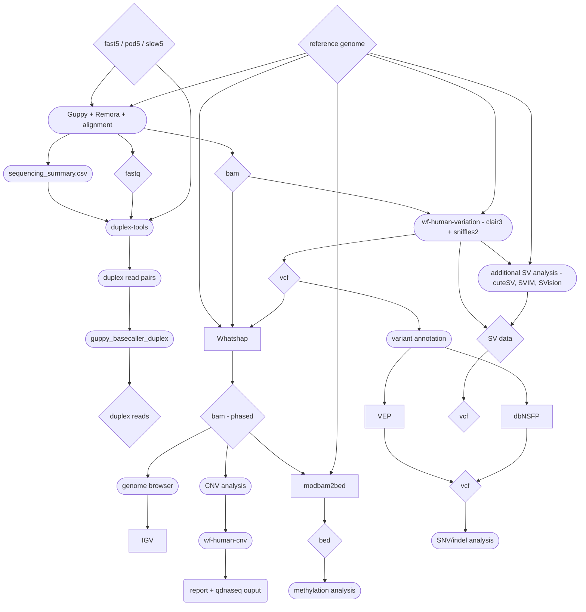

# README

Here we are implementing a generic workflow for processing ONT sequencing data based on the work Miles Benton and the Singapore - New Zealand Applications Project Support Team, Oxford Nanopore Technologies put together. This involves adapting the original scripts to run on ESR's production network, including deploying to slurm. See the original work this repository is based on in the [./docs/original_work/workflow_outline/](./docs/original_work/workflow_outline/) directory.

---

To get started analysing data with this "pipeline" on ESR's production network, see [./docs/analysis_docs/](./docs/analysis_docs/). Running this analysis on other compute infrastructures is not supported by the code/documentation in this repository, but is certainly possible and achievable with some bioinformatics knowledge.

---

## Workflow overview

