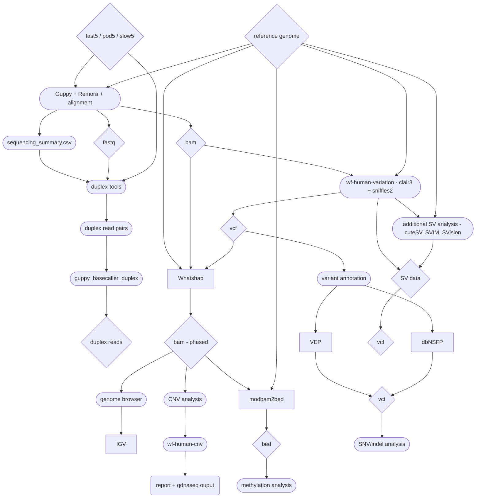

# ONT Human Workflow Overview

-----

// Singapore - New Zealand Applications Project Support Team, Oxford Nanopore Technologies  
// **author:** Miles Benton  
// **last modified:** 2022/10/12 11:15:27

-----

## Overview

The below chart gives a scematic of the general workflow as it currently stands.



## The pipeline 'modules'

The below bash scripts form the different "modules" of the workflow, each is self contained and was intended to be run as a PBS job (PBS parameters have been optimised for a specific compute infrastructure).

**NOTE:** please be aware that the below is example code only, it will need to be modified to reflect the users environment and variables before it will run successfully. It is intended as a guide at this stage. There is a Nextflow version coming soon which will be able to be run with minimal modification.

Also please note that some steps require a conda or virtual environment to be set up first. It also assumes that you have `Nextflow` set up and running on the compute infrastructure being used.

</br>

### 1. slow5/blow5 conversion

If you have raw data that's not in either fast5 or pod5 format then you'll likely want to convert it.
This step does the conversion from slow5/blow5 data back to fast5. It won't be required for most situations, so feel free to start at step 2.

```bash
#!/bin/bash -l
#PBS -N ont-slow5-convert
#PBS -l select=1:ncpus=24:mem=32gb
#PBS -l walltime=24:00:00
#PBS -M miles.benton@nanoporetech.com

#Change to folder where the job was submitted
cd $PBS_O_WORKDIR

# conda
# run the below first time to set up environment
# conda create --name slow5-tools  -c bioconda -c conda-forge slow5tools
conda activate slow5-tools

# define sample to process
SAMPLE='PBXP289487'

# split blow5
slow5tools split /work/datasets/compgen/garvan/$SAMPLE/$SAMPLE/ \
  -d /work/datasets/compgen/garvan/$SAMPLE/$SAMPLE/blow5/ \
  -r 4000 \
  -t 24

# convert to fast5
slow5tools s2f -p 24 \
  /work/datasets/compgen/garvan/$SAMPLE/$SAMPLE/blow5/ \
  -d /work/datasets/compgen/garvan/$SAMPLE/$SAMPLE/fast5

# Notes:
# this script will convert slow5/blow5 encoded ONT data back to the original fast5
# format, which is required for basecalling. The processing is greatly sped up by
# using multiple CPU threads.
```

</br>

### 2. GPU processing (Guppy + Remora + alignment)

This is currently the only step that benefits greatly from GPU usage. Guppy is running SUP (super accuracy basecalling), plus Remora for methylation calling, as well as performing alignment against GRCh38 using minimap2 in this step.

**NOTE:** Guppy basecalling requires the latest version of Guppy to be downlaoded from the Nanopore Community page. If you are a ONT customer you have access to this via your account.

```bash
#!/bin/bash -l
#PBS -N ont-guppy-gpu
#PBS -l select=1:ncpus=16:mem=52gb:ngpus=2:gputype=A100
#PBS -l walltime=36:00:00
#PBS -M miles.benton@nanoporetech.com

# define sample to process
INPUTDIR="/data/minknow/data/IPS_CNV_6Sep_P2/C3P5/20220906_1602_P2S_00011-2_PAM87954_6e6659a8/"
OUTPUTDIR="/data/basecalled/C35P5"
GUPPYPATH="/public-data/software/guppy/ont-guppy/bin/"
CONFIG="dna_r10.4.1_e8.2_400bps_modbases_5mc_cg_sup_prom.cfg"
REF="/public-data/references/GRCh38/GCA_000001405.15_GRCh38_no_alt_analysis_set.fna"

# Run Guppy+Remora+Alignment - check paths and parameters are correct
"${GUPPYPATH}"./guppy_basecaller \
  -c "${CONFIG}" \
  -a "${REF}" \
  -i "${INPUTDIR}" \
  -s "${OUTPUTDIR}" \
  --chunks_per_runner 412 \
  --recursive \
  --device "cuda:0,1" \
  --bam_out \
  --index
```

#### duplex calling

Duplex calling is "new" and only available on R10.4+ flowcells.

Note that this step hasn't yet been fully integrated into the workflow. The below will provide an example on how to set up and run everything required to generate duplex reads.

```bash
#!/bin/bash -l

# duplex calling
# set up
python3 -m venv venv --prompt duplex
. venv/bin/activate
pip install duplex_tools
# source the environment
source /public-data/software/venv/bin/activate

# make directory for duplex data
mkdir "${OUTPUTDIR}"/duplex

# identify pairs
duplex_tools pairs_from_summary "${OUTPUTDIR}"/sequencing_summary.txt "${OUTPUTDIR}"/duplex/
# filter pairs
duplex_tools filter_pairs "${OUTPUTDIR}"/duplex/pair_ids.txt "${INPUTDIR}"/fastq_pass/

# duplex basecalling
"${GUPPYPATH}"./guppy_basecaller_duplex \
  -i "${INPUTDIR}" \
  -r \
  -s "${OUTPUTDIR}"/duplex/ \
  -x 'cuda:0,1' \
  -c dna_r10.4.1_e8.2_400bps_sup.cfg \
  --chunks_per_runner 412 \
  --duplex_pairing_mode from_pair_list \
  --duplex_pairing_file "${OUTPUTDIR}"/duplex/pair_ids_filtered.txt

# Notes:
# remember to change --chunks_per_runner to fit with the GPU resources that are available
```

</br>

### 3. merge bams

Guppy generates a bam file per fast5 file, so these are required to me merged for further processing.

```bash
#!/bin/bash -l
#PBS -N ont-bam-merge
#PBS -l select=1:ncpus=16:mem=64gb
#PBS -l walltime=24:00:00
#PBS -M miles.benton@nanoporetech.com

# conda
# run the below first time to set up environment
# conda create --name genome-tools  -c bioconda -c conda-forge samtools sambamba bamtools
conda activate genome-tools

# define variables
WKDIR='/data/basecalled/'
SAMPLE='C1P5'

# make bam dir and move to working dir
mkdir ${WKDIR}/${SAMPLE}/bam
cd ${WKDIR}/${SAMPLE}

# set a soft ulimt (number of open files)
ulimit -n 6000

# bamtools
ls pass/*.bam > ./bam/bam_list.txt
bamtools merge -list ./bam/bam_list.txt -out ./bam/${SAMPLE}_merged.bam
sambamba sort -m 64GB -t 12 ./bam/${SAMPLE}_merged.bam -o ./bam/${SAMPLE}_sorted_merged.bam
sambamba index -t 12 ./bam/${SAMPLE}_sorted_merged.bam

# Notes:
# merge all guppy output bams
```

</br>

### 4. wf-human-variation (clair3, sniffles2)

https://github.com/epi2me-labs/wf-human-variation

This is an in development pipeline that is part of our EPI2ME-labs bioinformatics tool set. At the moment this pipeline performs alignment, SNV calling (`clair3`), SV detection (`sniffles2`), and methylation calling (`modbam2bed`).

Over time other steps of this workflow, i.e. CNV analysis, will likely make their way into `wf-human-variation`, so it's worth keeping an eye on updates to our software.

```bash
#!/bin/bash -l
#PBS -N ont-variant-calling
#PBS -l select=1:ncpus=48:mem=128GB
#PBS -l walltime=24:00:00
#PBS -M miles.benton@nanoporetech.com

# define variables
WKDIR='/data/basecalled/'
SAMPLE='C1P5'
MODEL='/public-data/software/rerio/clair3_models/r1041_e82_400bps_sup_g615'
REFERENCE='/public-data/references/GRCh38/GCA_000001405.15_GRCh38_no_alt_analysis_set.fna'
TDREPETS='/public-data/references/GRCh38/human_GRCh38_no_alt_analysis_set.trf.bed'
OUTPUT='results'
NFCONFIG='/public-data/configs/nextflow.config'
# note: created an overide config to provide modified CPU and Memory values
# change these values if you want to tweak performance based on resources

# move to working dir
cd ${WKDIR}/${SAMPLE}
mkdir results

# run Clair3 variant calling and sniffles2
nextflow -c ${NFCONFIG} run epi2me-labs/wf-human-variation \
  -resume \
  --threads 24 \
  -profile standard,local \
  --snp --sv \
  --phase_vcf \
  --use_longphase \
  --tr_bed ${TDREPETS} \
  --model ${MODEL} \
  --bam ./bam/${SAMPLE}_sorted_merged.bam \
  --ref ${REFERENCE} \
  --out_dir ${OUTPUT}

# Notes:
# This step calls the ONT wf-human-variation nextflow pipeline
# (https://github.com/epi2me-labs/wf-human-variation), which performs variant calling (clair3),
# phase marking, and structural variant calling using sniffles2 (sniffles2 was a seperate step
# previously). 
```

</br>

### 5. whatshap (phasing)

This step phases the reads based on the variants that had been assigned haplotypes in the `clair3` step above. Having phased information is very useful for generating things such as allele specific methylation.

```bash
#!/bin/bash -l
#PBS -N ont-whatshap-phaseing
#PBS -l select=1:ncpus=16:mem=64GB
#PBS -l walltime=24:00:00
#PBS -M miles.benton@nanoporetech.com

# conda
# run the below first time to set up environment
# conda create --name whatshap -c bioconda -c conda-forge whatshap samtools
conda activate whatshap

# define variables
WKDIR='/data/basecalled/'
SAMPLE='C3P5'
REFERENCE='/public-data/references/GRCh38/GCA_000001405.15_GRCh38_no_alt_analysis_set.fna'
OUTPUT='results'

# move to working dir
cd ${WKDIR}/${SAMPLE}

# whatshap phase tagging of bam output
whatshap haplotag \
    --ignore-read-groups \
    --output ./bam/${SAMPLE}_sorted_merged.hp.bam  \
    --reference ${REFERENCE} \
    ${OUTPUT}/all.wf_snp.vcf.gz ./bam/${SAMPLE}_sorted_merged.bam
# index bam
samtools index -@ 16 ./bam/${SAMPLE}_sorted_merged.hp.bam

# conda
conda deactivate

# Notes:
# this step phases the data based on the clair3 output and generates a 
# phased bam file. This contains information assigning reads to each
# haplotype. At this stage the bam is able to loaded into a genome 
# viewer/browser and contains aligned reads, with base modification
# (methylation) information, as well as the haplotype information.
```

</br>

### 6. methylation calling

This methylation calling step generates three bed files:

* an aggragated methylation call per CpG site
* methylation calls for haplotype 1
* methylation calls for haplotype 2

The most recent version of the `wf-human-variation` (as of 2022-10-12) pipeline currently generates the first bed but doesn't provide haplotype specific methylation data.

```bash
#!/bin/bash -l
#PBS -N ont-methyl-calling
#PBS -l select=1:ncpus=16:mem=32GB
#PBS -l walltime=06:00:00
#PBS -M miles.benton@nanoporetech.com

# conda
# create --name modbam2bed -c bioconda -c conda-forge -c epi2melabs modbam2bed
conda activate modbam2bed

# define variables
WKDIR='/data/basecalled/'
SAMPLE='C1P5'
REFERENCE='/public-data/references/GRCh38/GCA_000001405.15_GRCh38_no_alt_analysis_set.fna'

# move to working dir
cd ${WKDIR}/${SAMPLE}
mkdir bed

# create methylation bed files
for HP in 1 2; do
    modbam2bed \
        -e -m 5mC --cpg -t 16 --haplotype ${HP} \
        ${REFERENCE} \
        ./bam/${SAMPLE}_sorted_merged.hp.bam \
        | bgzip -c > ./bed/${SAMPLE}_methylation.hp${HP}.cpg.bed.gz
done;

# create an aggregated bed file
modbam2bed \
  -e -m 5mC --cpg --aggregate -t 16 \
  ${REFERENCE} \
  ./bam/${SAMPLE}_sorted_merged.hp.bam \
  | bgzip -c > ./bed/${SAMPLE}_methylation.aggregated.cpg.bed.gz

# Notes:
# this step extracts the methylation information from the bam file, generating
# bed files. There are two processes here, the first creates two bed files, one
# for each haplotype. These are very useful for exploring allele specific methylation.
# The second process generates a single aggragated bed file, it merges the 
# haplotype data to give site specific methylation. It should be noted that this is 
# per strand, so some processing will be required to 'collapse' the data to a
# single CpG site, but this type of work is usually performed in the downstream\
# analysis, using packages such as methylkit.
```

</br>

### 7. Alternate SV methods

The default method for calling structural variants is `sniffles2`, which is now built into the EPI2ME-labs `wf-human-variation` pipeline. If you wish to explore other tools it's easy enough to run them on the data generated from the previous steps.

#### cuteSV

https://github.com/tjiangHIT/cuteSV

```bash
#!/bin/bash -l
#PBS -N ont-sv-cutesv
#PBS -l select=1:ncpus=16:mem=128GB
#PBS -l walltime=06:00:00
#PBS -M miles.benton@nanoporetech.com

# conda
# run the below first time to set up environment
# conda create --name cutesv -c bioconda cutesv
conda activate cutesv

# define variables
WKDIR='/work/ont/WGS'
SAMPLE='PBXP289487'
REFERENCE='/work/ont/reference/GCA_000001405.15_GRCh38_no_alt_analysis_set.fasta'
OUTPUT='results'

# move to working dir
cd ${WKDIR}/${SAMPLE}
mkdir cutesv_tmp

# cuteSV processing
cuteSV -t 16 \
  --max_cluster_bias_INS 100 \
  --diff_ratio_merging_INS 0.3 \
  --max_cluster_bias_DEL 100 \
  --diff_ratio_merging_DEL 0.3 \
  ./bam/${SAMPLE}_sorted_merged.hp.bam \
  ${REFERENCE} \
  ${OUTPUT}/${SAMPLE}_sv_cutesv.vcf \
  ./cutesv_tmp

# Notes:
# this step is for evaluation of another structural variant caller, cuteSV. It's 
# often nice to have the ability to compare results between various tools. As 
# SVs are important to this project this step has been included in the process.
# For other projects it may well be enough to stop after processing step 06.
# This process outputs a vcf file with the structural variation recorded per
# line.
```

#### SVIM

https://github.com/eldariont/svim

**... WORK IN PROGRESS ...**

#### Svision

https://github.com/xjtu-omics/SVision

**... WORK IN PROGRESS ...**

</br>

### 8. wf-human-cnv

**... WORK IN PROGRESS ...**

We have recently release our CNV calling Nextflow pipeline ([link](https://github.com/epi2me-labs/wf-cnv)). This module is again self contained and can be run at any stage.

The below is an example of how to run the pipeline on an ONT data set:

```bash
#!/bin/bash -l

nextflow run epi2me-labs/wf-cnv \
  --fastq /data/basecalled/fastq/ \
  --sample_sheet sample_sheet.csv \
  --fasta /public-data/references/GRCh38/GCA_000001405.15_GRCh38_no_alt_analysis_set.fna \
  --genome hg38 --bin_size 500
```

This CNV pipeline will run on the basecalled `fastq` files, it will run an alignment against the provided reference genome, and then perform CNV analysis using `QDNAseq`.

-----

<p style="text-align: center;"> Document created by <b>Miles Benton</b> and the Singapore - New Zealand
Applications Project Support Team, Oxford Nanopore Technologies </p>

<p style="text-align: center;"> <a href="";> miles.benton@nanoporetech.com </a> </p>
<p style="text-align: center;"> <a href="https://nanoporetech.com"; target="blank";> nanoporetech.com </a> </p>
